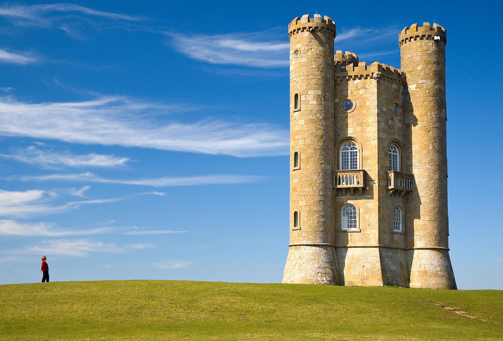
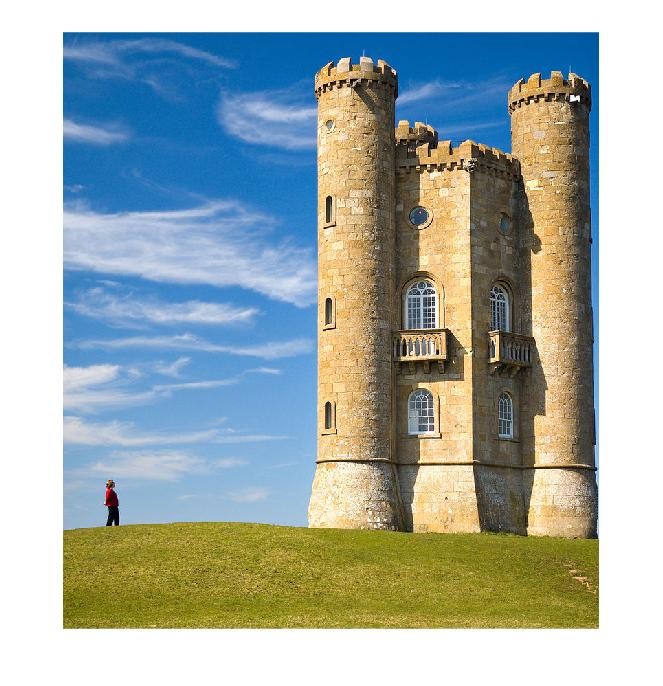

# Seam Carving
### Content Aware Image Resizing
Seam carving (or liquid rescaling) is an algorithm for content-aware image resizing, developed by Shai Avidan, of Mitsubishi Electric Research Laboratories (MERL), and Ariel Shamir, of the Interdisciplinary Center and MERL. 
It functions by establishing a number of seams (paths of least importance) in an image and automatically removes seams to reduce image size or inserts seams to extend it. 

#### Input Image

#### Output after 500 iterations

